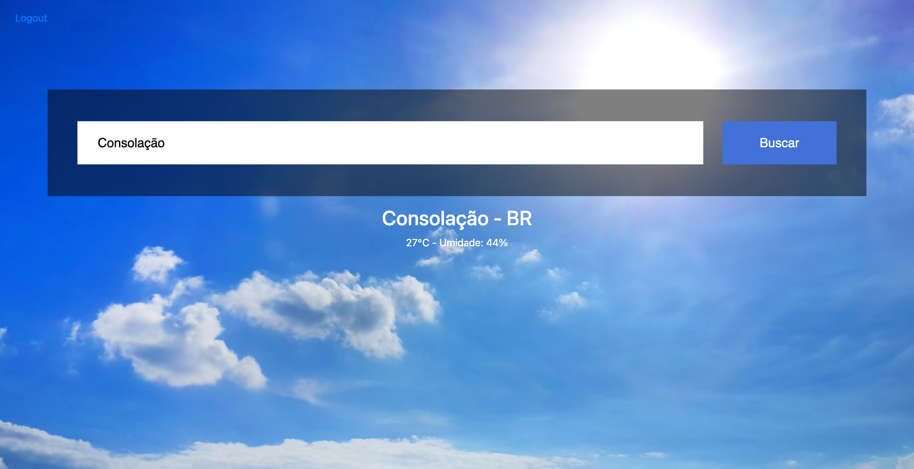

# Sobre o Teste 

- Feito busca a partir da localicação do usuário no navegador
- Login e um fake backend para acesso área restrita
- Busca ao endpoint por cidade, e pela geolocalização do usuário

## Para testar localmente 
- Necessário inserir o KeyApi do site OpenWathermap em environments: `apiKeyOpenWeathermap`

## Teste Builders desenvolvido em angular 11

This project was generated with [Angular CLI](https://github.com/angular/angular-cli) version 11.1.4.

## Test Demo em deploy para visualização
> [Builders](https://rubensoul.com.br/builders)

## Screenshots da tela de Login

## Screenshots tela de busca

## Development server

Run `ng serve` for a dev server. Navigate to `http://localhost:4200/`. The app will automatically reload if you change any of the source files.

## Code scaffolding

Run `ng generate component component-name` to generate a new component. You can also use `ng generate directive|pipe|service|class|guard|interface|enum|module`.

## Build

Run `ng build` to build the project. The build artifacts will be stored in the `dist/` directory. Use the `--prod` flag for a production build.

## Running unit tests

Run `ng test` to execute the unit tests via [Karma](https://karma-runner.github.io).

## Running end-to-end tests

Run `ng e2e` to execute the end-to-end tests via [Protractor](http://www.protractortest.org/).

## Further help

To get more help on the Angular CLI use `ng help` or go check out the [Angular CLI Overview and Command Reference](https://angular.io/cli) page.
